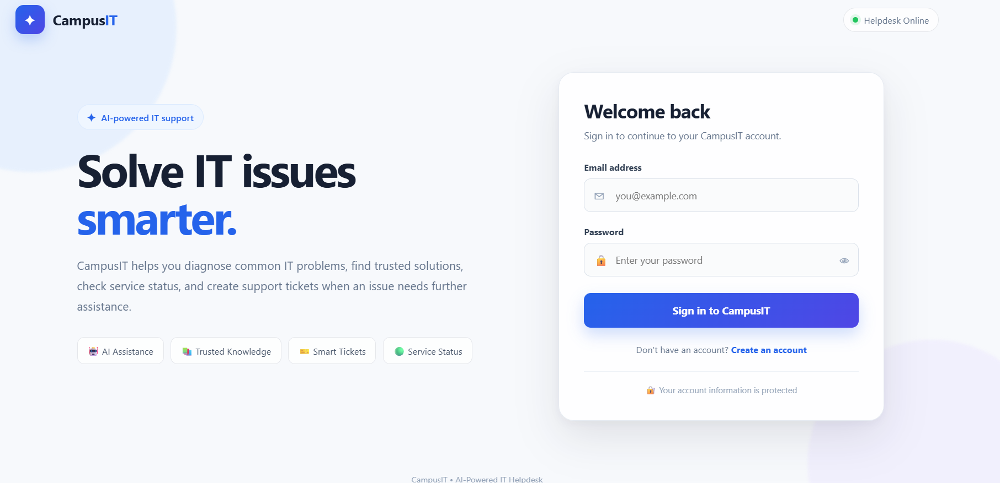
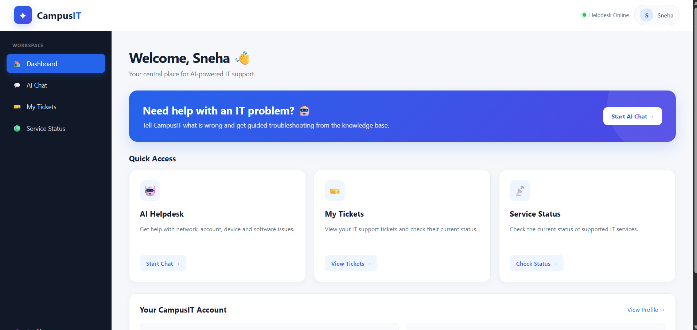
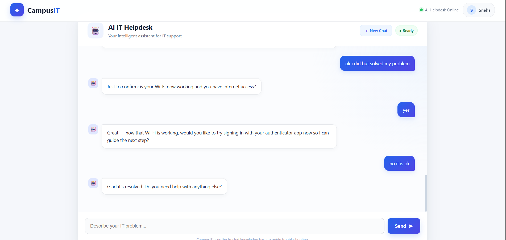
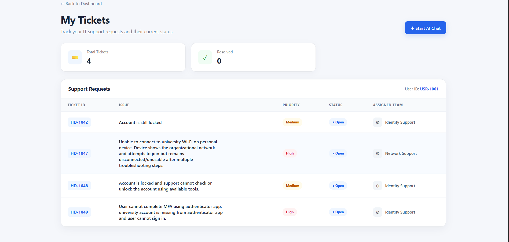
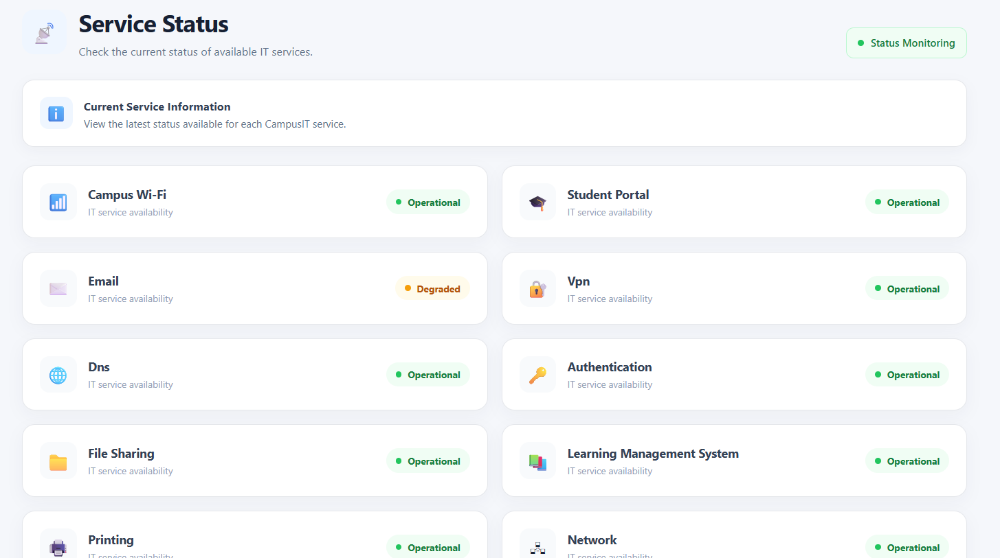
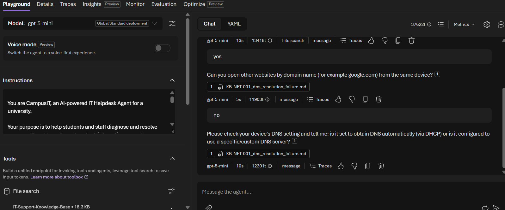
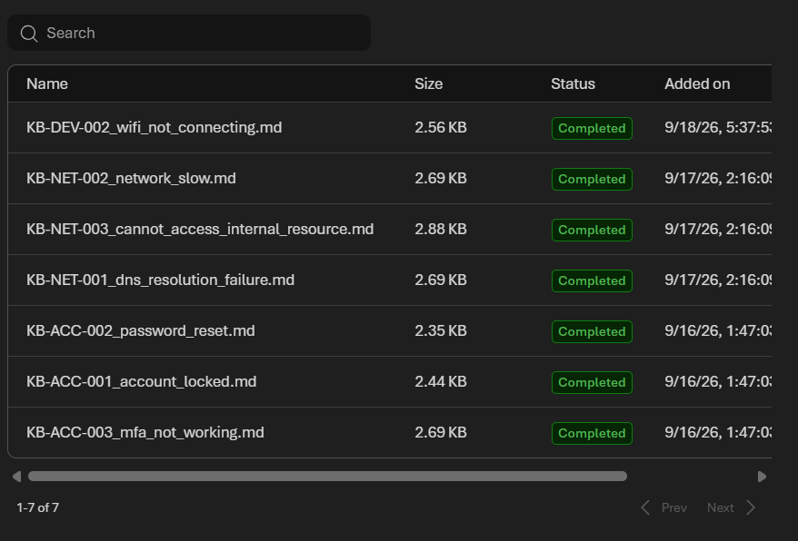

# IT Help Desk Agent

An AI-powered IT Help Desk Agent designed to assist users with common IT issues, provide troubleshooting guidance, manage support tickets, and access a structured IT knowledge base through a web-based interface.

The project combines a **Django web application** with an **AI-powered agent using Azure AI Foundry** to provide intelligent IT support.

---

## Features

* User registration and login
* User dashboard
* AI-powered IT support chat
* Troubleshooting assistance
* Structured IT knowledge base
* Support ticket creation
* Ticket status tracking
* Service status checking
* User profile management
* Device and service information
* Azure AI Foundry integration
* Agent tools for IT support operations

---

## IT Issues Covered

The knowledge base contains troubleshooting information for several common IT problems.

### Accounts

* Account locked
* Password reset
* MFA not working

### Devices

* Laptop running slowly
* Wi-Fi not connecting
* Printer not printing

### Network

* DNS resolution failure
* Slow network
* Unable to access internal resources

## How the AI Help Desk Works

1. The user logs into the application.
2. The user describes an IT problem through the chat interface.
3. The AI agent analyzes the user's request.
4. The agent can use the available knowledge base and tools to identify relevant information.
5. The agent provides troubleshooting guidance to the user.
6. If additional assistance is required, the user can create a support ticket.
7. The user can track the status of their tickets from the dashboard.

---

## Tech Stack

### Backend

* Python
* Django

### AI

* Azure AI Foundry
* AI-powered IT Help Desk Agent

### Frontend

* HTML
* CSS
* JavaScript
* Django Templates

### Database

* SQLite

### Development Tools

* Visual Studio Code
* Git
* GitHub

## Screenshots

### Login Page

### Dashboard

### AI Help Desk Chat

### My Tickets

### Service Status

---

## Azure AI Foundry

The project uses **Azure AI Foundry** to support the AI-powered Help Desk Agent.

### Azure AI Foundry Project

### AI Agent

### knowledge base

> **Note:** Screenshots should not contain API keys, passwords, access tokens, connection strings, or other sensitive credentials.

---

## Agent Tools

The project contains several tools that support IT Help Desk operations.

### Ticket Tools

Used for operations related to creating and managing support tickets.

### Ticket Status Tool

Used to check the status of an existing support ticket.

### Service Status Tool

Used to provide information about the status of available IT services.

### Run Locally

git clone https://github.com/gargsneha11/ITHelpDeskAgent.git
cd ITHelpDeskAgent

python -m venv venv
venv\Scripts\activate

pip install -r requirements.txt

python manage.py migrate
python manage.py runserver

Then open:

http://127.0.0.1:8000/

Note: Keep API keys and other sensitive credentials in .env and never upload them to GitHub.
